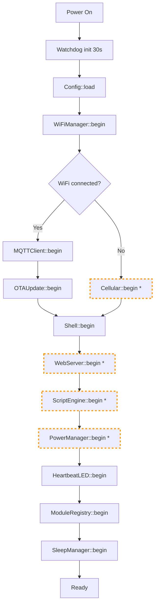

# Overview

## Design Principles

- **Modular** - each sensor or peripheral is a self-contained module
- **Config-driven** - compile-time enables via `config.h`, runtime values via `config.json` on LittleFS
- **Event-driven** - modules communicate via an internal Event Bus, not direct calls
- **Pluggable** - adding a new module requires creating one folder and one line in `config.h`
- **Resilient** - automatic WiFi to cellular fallback; MQTT queue survives short disconnects
- **Scriptable** - Lua 5.3 runtime with hot-reloadable rules; no recompile needed for logic changes

---

## Repository Structure

```
thesada-fw/base/
├── platformio.ini                  <- build targets + library deps
├── config.h                        <- compile-time module enables + version
├── scripts/
│   ├── generate_manifest.py        <- post-build: build/firmware.json with SHA256 + version
│   └── copy_firmware.py            <- post-build: copies .bin to build/
├── tests/
│   └── test_firmware.py            <- automated + manual test suite (pyserial)
├── lib/
│   └── AsyncTCP/                   <- vendored AsyncTCP v3.3.2 (null-PCB crash fixes)
├── data/
│   ├── config.json                 <- runtime config (LittleFS)
│   ├── ca.crt                      <- TLS CA cert (required for cert verification)
│   └── scripts/
│       ├── main.lua                <- Lua boot script (runs once at startup)
│       └── rules.lua               <- Lua event rules (hot-reloadable)
└── src/
    ├── main.cpp
    ├── core/                           <- always compiled
    │   ├── Module.h                <- base class for all modules
    │   ├── ModuleRegistry.h/.cpp   <- instantiates + drives all modules
    │   ├── EventBus.h/.cpp         <- pub/sub between modules
    │   ├── Config.h/.cpp           <- config.json loader (LittleFS)
    │   ├── Log.h/.cpp              <- serial + WebSocket log relay
    │   ├── WiFiManager.h/.cpp      <- multi-SSID, RSSI-ranked, NTP sync
    │   ├── MQTTClient.h/.cpp       <- TLS MQTT, publish queue, MQTT CLI
    │   ├── OTAUpdate.h/.cpp        <- HTTP(S) pull OTA with SHA256 verify
    │   ├── Shell.h/.cpp            <- unified CLI (serial, WS, HTTP, MQTT)
    │   └── SleepManager.h/.cpp     <- deep sleep orchestrator (RTC memory)
    └── modules/                        <- optional (ENABLE_* guards)
        ├── temperature/            <- DS18B20 one-wire sensors
        ├── ads1115/                <- ADS1115 RMS current sensing
        ├── battery/                <- battery monitoring (requires PMU)
        ├── powermanager/           <- AXP2101 PMU, charging, heartbeat LED
        ├── cellular/               <- SIM7080G modem + LTE-M fallback
        ├── sd/                     <- SD card CSV logger
        ├── telegram/               <- Telegram Bot API (direct send)
        ├── webserver/              <- web dashboard, REST API, WS terminal
        ├── scriptengine/           <- Lua 5.3 scripting engine
        ├── display/                <- SSD1306 OLED (Lua-driven rendering)
        └── pwm/                    <- PWM output
```

---

## Boot Sequence



Dashed boxes (*) are guarded by `ENABLE_*` flags - they compile out when disabled.

---

## Module Base Class

Every module inherits from `Module`:

```cpp
class Module {
public:
  virtual void begin() = 0;
  virtual void loop()  = 0;
  virtual const char* name() = 0;
  virtual ~Module() {}
};
```

The `ModuleRegistry` calls `begin()` once at startup and `loop()` every cycle. Modules should never block in `loop()`.

---

## Event Bus

Modules never call each other directly. They publish events with a JSON payload and subscribe to events from other modules. The Event Bus is synchronous - subscribers run inline when `publish()` is called.

```cpp
// Publish a temperature reading (in TemperatureModule)
JsonDocument doc;
JsonArray sensors = doc["sensors"].to<JsonArray>();
JsonObject s = sensors.add<JsonObject>();
s["name"]   = "barn_supply";
s["temp_c"] = 18.4;
EventBus::publish("temperature", doc.as<JsonObject>());

// Subscribe (in TelegramModule or any other module)
EventBus::subscribe("temperature", [](JsonObject data) {
  JsonArray sensors = data["sensors"].as<JsonArray>();
  for (JsonObject s : sensors) {
    float temp = s["temp_c"] | -999.0f;
    // react to reading
  }
});
```

**Standard event names and payload schemas:**

| Event | Publisher | Payload |
|---|---|---|
| `temperature` | TemperatureModule | `{ "sensors": [ { "name": "x", "address": "...", "temp_c": 18.4 } ] }` |
| `current` | ADS1115Module | `{ "channels": [ { "name": "x", "voltage_v": 0.012, "raw": 123 } ] }` |
| `battery` | BatteryModule | `{ "present": true, "voltage_v": 3.91, "percent": 35, "charging": false }` |
| `alert` | TelegramModule | `{ "value": "alert message text" }` (MQTTClient and CellularModule subscribe) |
